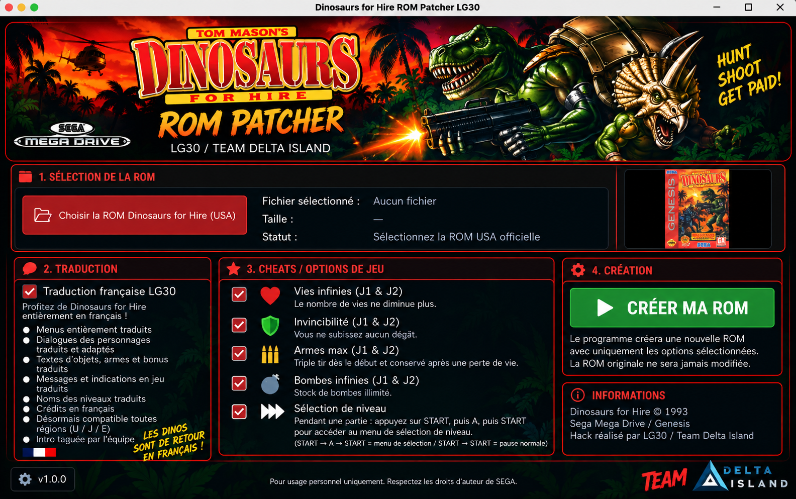

# Dinosaurs for Hire - Traduction Française

<p align="center">
  
</p>

## Présentation

Ce projet permet de créer une version française de **Tom Mason's Dinosaurs for Hire** sur **Sega Mega Drive / Genesis**, à partir de la ROM originale USA.

La traduction française comprend les menus, les dialogues, les biographies des personnages, les indications en jeu, les noms des niveaux ainsi que les crédits.

Plusieurs adaptations ont également été réalisées afin de conserver un affichage naturel et cohérent en français.

---

## ROM originale

**Tom Mason's Dinosaurs for Hire (USA) - Sega Genesis / Mega Drive**

Nom généralement utilisé :

`Tom Mason's Dinosaurs for Hire (USA).md`

**Taille :**  
1 048 576 octets (1 Mo)

**MD5 :**  
`E4C6CBF1A2EA36404FB69667CD080B4F`

**SHA-1 :**  
`D006EFBF1D811E018271745925FE00CA6D93F24F`

Le ROM Patcher vérifie automatiquement que la ROM sélectionnée correspond bien à la version USA compatible.

---

## Utilisation du ROM Patcher

1. Lancez `DinosaursForHirePatcher.jar`
2. Cliquez sur **« Choisir la ROM Dinosaurs for Hire (USA) »**
3. Sélectionnez votre ROM originale USA
4. Laissez **« Traduction française »** activé
5. Si vous le souhaitez, activez un ou plusieurs cheats
6. Cliquez sur **« CRÉER MA ROM »**

Le fichier créé sera nommé :

`Dinosaurs_for_Hire_FR.bin`

## Compilation

Le patcher ne dépend que de Java 17 (ou plus récent) et de Gradle. Depuis la
racine du dépôt :

```bash
gradle clean check jar
```

Le fichier autonome est alors disponible sous
`build/libs/DinosaursForHirePatcher.jar`. Il se lance sur Windows, macOS et
Linux avec :

```bash
java -jar build/libs/DinosaursForHirePatcher.jar
```

La tâche `check` reconstruit la ROM française depuis la ROM USA, vérifie son
identité octet par octet avec la référence finale, contrôle son SHA-1, teste
chaque cheat ainsi que le checksum Mega Drive. La ROM française de référence
n'est pas embarquée dans le JAR : celui-ci contient uniquement les blocs de
différences nécessaires à la traduction, stockés dans le dépôt sous forme de
ressource texte Base64. Le bandeau est intégré au moment du build depuis le
fichier `Image.png` déjà présent à la racine.

---

## Cheats disponibles

### Vies infinies (J1 & J2)
Le nombre de vies ne diminue plus.

### Bombes infinies (J1 & J2)
Stock de bombes illimité.

### Invincibilité (J1 & J2)
Vous ne subissez aucun dégât.

### Armes max (J1 & J2)
Triple tir dès le début et conservé après une perte de vie.

### Sélection de niveau

Pendant une partie, appuyez sur **START**, puis **A**, puis **START** pour accéder au menu de sélection de niveau.

`START → A → START` = menu de sélection de niveau  
`START → START` = pause normale

Tous les cheats sont optionnels.

Sans cheat sélectionné, le patcher crée simplement la version française du jeu.

---

## Modifications

- Menus entièrement traduits
- Dialogues des personnages traduits et adaptés
- Biographies des trois dinosaures traduites et adaptées
- Tailles et poids convertis au système métrique
- Textes d'objets, armes et bonus traduits
- Messages et indications en jeu traduits
- Noms des niveaux traduits
- Crédits en français
- Réalignement de certains éléments des menus
- ROM étendue de **1 Mo à 2 Mo** afin de permettre la décompression, la modification et la relocalisation des textes français
- Compatibilité régions **USA / Europe / Japon**
- Écran d'introduction **LG30 / Team Delta Island**

---

## Crédits

**Traduction, adaptation, modifications et ROM Patcher :**  
LG30 / Team Delta Island

Tom Mason's Dinosaurs for Hire, SEGA et les marques associées appartiennent à leurs propriétaires respectifs.

Projet réalisé à titre personnel et non commercial.

---

<p align="center">
  <strong>HUNT! SHOOT! GET PAID!</strong>
</p>
